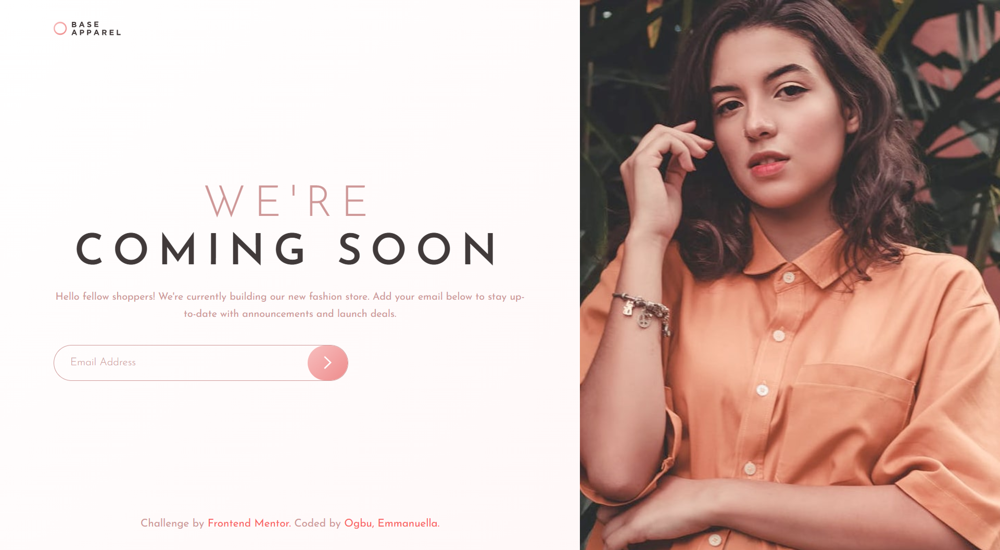

# Frontend Mentor - Base Apparel coming soon page solution

This is a solution to the [Base Apparel coming soon page challenge on Frontend Mentor](https://www.frontendmentor.io/challenges/base-apparel-coming-soon-page-5d46b47f8db8a7063f9331a0). 
  Frontend Mentor challenges help improve real-world coding skills by building practical and responsive projects.

## Table of contents

- [Frontend Mentor - Base Apparel coming soon page solution](#frontend-mentor---base-apparel-coming-soon-page-solution)
  - [Table of contents](#table-of-contents)
  - [Overview](#overview)
    - [The challenge](#the-challenge)
    - [Screenshot](#screenshot)
    - [Links](#links)
  - [My process](#my-process)
    - [Built with](#built-with)
    - [What I learned](#what-i-learned)
    - [Continued development](#continued-development)
    - [AI Collaboration](#ai-collaboration)
- [During this project, I used AI tools like Claude to:](#during-this-project-i-used-ai-tools-like-claude-to)
    - [Challenges Encountered:](#challenges-encountered)
  - [Author](#author)
  - [Acknowledgments](#acknowledgments)


## Overview

### The challenge

Users should be able to:

- View the optimal layout for the site depending on their device's screen size
- See hover states for all interactive elements on the page
- Receive an error message when the `form` is submitted if:
  - The `input` field is empty
  - The email address is not formatted correctly

### Screenshot



### Links

- Solution URL: [Add solution URL here](https://your-solution-url.com)
- Live Site URL: [https://emmanuella-ogbu.github.io/Frontend-Mentor-Challenges/base-apparel-fashion-shop/]

## My process

### Built with

- Semantic HTML5 markup
- CSS custom properties
- Flexbox
- CSS Grid
- Mobile-first workflow
- Vanilla JavaScript 

### What I learned

This project helped me deepen my understanding of understanding layout and form validation.

I learned how display: block affects inline elements like images and why it helps with layout control.
I practiced combining multiple background properties, such as gradients and images, into a single declaration.
I understood how to switch between mobile and desktop images using the <picture> element and responsive techniques.
I improved my use of Flexbox for positioning and saw the importance of properties like flex-shrink.
I implemented basic email validation using JavaScript and regular expressions.

To see how you can add code snippets, see below:

```css
.error-message {
  display: none;
  color: hsl(0, 93%, 68%);
  font-size: 0.8rem;
  font-weight: 300;
  margin-top: 0.5rem;
  margin-left: 2rem;
}
.hero-image {
    grid-column: 2;
    grid-row: 1 / 4;
    overflow: hidden;
  }
  @media (min-width: 768px) {
  body {
    display: grid;
    grid-template-columns: 58% 42%;
    grid-template-rows: auto 1fr auto;
    min-height: 100vh;
    background:
      url('../images/bg-pattern-desktop.svg') left center / 58% 100% no-repeat,
      linear-gradient(135deg, hsl(0, 0%, 100%), hsl(0, 100%, 98%));
  }
  }

```
```js
const emailPattern = /^[^\s@]+@[^\s@]+\.[^\s@]+$/;

setTimeout(function() {
      alert('Thank you! You will be notified at launch.');
}, 10);
```

### Continued development

- Explore adding subtle animation and transitions to make the interface feel more interactive.
- Explore accessibility best practices for forms and inputs
- Write cleaner, more modular JavaScript code

### AI Collaboration

# During this project, I used AI tools like Claude to:

- Underatand why my image was breaking in the desktop size


### Challenges Encountered:
- One of the main challenges I encountered was ensuring that error states were both visually clear and accessible, which required careful structuring of the CSS and JavaScript, as the errors were hidden in the CSS design but visible in JavaScript.

- I also faced challenges with achieving consistent responsiveness across different screen sizes, especially when combining Flexbox and CSS Grid. I resolved this by adopting a mobile-first workflow and testing layouts incrementally.

- Additionally, aligning background images and gradients correctly across breakpoints required experimentation with CSS background properties, which helped me better understand how layout and positioning work.

## Author

- GitHub - [Emmanuella Ogbu](https://github.com/Emmanuella-Ogbu)
- Frontend Mentor - [@Emmanuella-Ogbu](https://www.frontendmentor.io/profile/Emmanuella-Ogbu)

## Acknowledgments

- Thanks to the Frontend Mentor community for providing realistic challenges and inspiration. 
- Also, appreciation to online resources that helped clarify concepts during this project.
