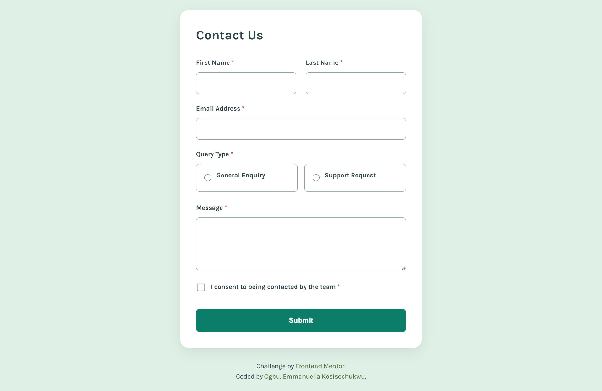

# Frontend Mentor — Contact Form Solution

This is my solution to the [Contact Form challenge on Frontend Mentor](https://www.frontendmentor.io/challenges/contact-form--G-hYlqKJj).

## Table of contents

- [Frontend Mentor — Contact Form Solution](#frontend-mentor--contact-form-solution)
  - [Table of contents](#table-of-contents)
  - [Overview](#overview)
    - [The challenge](#the-challenge)
    - [Screenshot](#screenshot)
    - [Links](#links)
  - [My process](#my-process)
    - [Built with](#built-with)
    - [What I learned](#what-i-learned)
    - [Continued development](#continued-development)
    - [Useful resources](#useful-resources)
  - [Author](#author)

---

## Overview

### The challenge

Users should be able to:

- Complete the form and see a success toast message upon successful submission
- Receive form validation messages if a required field has been missed or the email address is not formatted correctly
- Complete the form using only their keyboard
- Have inputs, error messages, and the success message announced by their screen reader
- View the optimal layout for the interface depending on their device's screen size
- See hover and focus states for all interactive elements on the page

### Screenshot

 

### Links

- Solution URL: [(https://www.frontendmentor.io/solutions/contact-form-built-to-include-screen-readers-using-html-css-and-js-eo-CY-feTY)]
- Live Site URL: (https://emmanuella-ogbu.github.io/Frontend-Mentor-Challenges/contact-form/)

---

## My process

### Built with

- Semantic HTML5 markup
- CSS custom properties (variables)
- Flexbox and CSS Grid for layout
- Mobile-first responsive design
- avaScript — no frameworks
- ARIA attributes for full accessibility

### What I learned

**1. Accessible form structure**

The biggest thing I learned in this project was how to build forms that work for everyone — including people using screen readers or navigating by keyboard only. I had never used `aria-describedby` before this project. It links each input to its error message so that when a screen reader focuses on a field, it announces both the label and any associated error automatically.

```html
<input
  type="email"
  id="email"
  aria-required="true"
  aria-describedby="email-error"
/>
<span id="email-error" role="alert"></span>
```

**2. Grouping radio buttons correctly**

I learned that radio buttons should always be wrapped in a `<fieldset>` with a `<legend>`. This is the accessible way to group related inputs — without it, screen readers cannot tell which question the radio buttons belong to.

```html
<fieldset>
  <legend>Query Type <span aria-hidden="true">*</span></legend>
  <label>
    <input type="radio" name="query-type" value="general" />
    General Enquiry
  </label>
</fieldset>
```

**3. Live regions for dynamic announcements**

To announce the success toast to screen readers (who cannot see it visually appearing), I used a hidden `aria-live` region. Any text placed inside it is read aloud automatically by screen readers — even if the element is visually hidden.

```html
<div aria-live="assertive" aria-atomic="true" class="sr-only"></div>
```

**4. Custom radio and checkbox styling**

Browser-default radio and checkbox inputs are very hard to style consistently. I used `appearance: none` to reset them, then built the visual states (checked, hover, focus) entirely with CSS — keeping full keyboard and screen reader support intact.

```css
input[type="radio"] {
  appearance: none;
  width: 1.1rem;
  height: 1.1rem;
  border: 1.5px solid var(--grey-medium);
  border-radius: 50%;
}

input[type="radio"]:checked {
  background: var(--green-base);
  border-color: var(--green-base);
}
```

**5. CSS custom properties for theming**

Using CSS variables made it very easy to keep colours consistent across the whole form without repeating hex values everywhere.

```css
:root {
  --green-base: #0d9488;
  --green-medium: #2a7c6f;
  --grey-light: #dce3ea;
  --red: #d73c3c;
}
```

### Continued development

In future projects I want to:

- Practice writing JavaScript in a more modular, function-based way rather than putting all logic in one event listener
- Learn how to test accessibility properly using a real screen reader (NVDA or VoiceOver)
- Explore CSS animations to make the toast notification feel more polished
- Begin learning how to handle forms with a backend (sending data to a server)

### Useful resources

- [MDN — ARIA live regions](https://developer.mozilla.org/en-US/docs/Web/Accessibility/ARIA/ARIA_Live_Regions) — This explained exactly how `aria-live` works and when to use `assertive` vs `polite`.
- [MDN — fieldset and legend](https://developer.mozilla.org/en-US/docs/Web/HTML/Element/fieldset) — Helped me understand why grouping radio buttons in a fieldset matters for accessibility.
- [WebAIM — Keyboard Accessibility](https://webaim.org/techniques/keyboard/) — Taught me what "keyboard accessible" actually means in practice and how to test it.
- [CSS-Tricks — A Complete Guide to Flexbox](https://css-tricks.com/snippets/css/a-guide-to-flexbox/) — My go-to reference for layout questions.

---

## Author
Ogbu, Emmanuella Kosisochukwu

- Frontend Mentor — [@emma-401](https://www.frontendmentor.io/profile/emma-401)
- GitHub — [@emma-401](https://github.com/emma-401)
- LinkedIn — [@ellaogbu455](https://www.linkedin.com/in/ellaogbu455)
