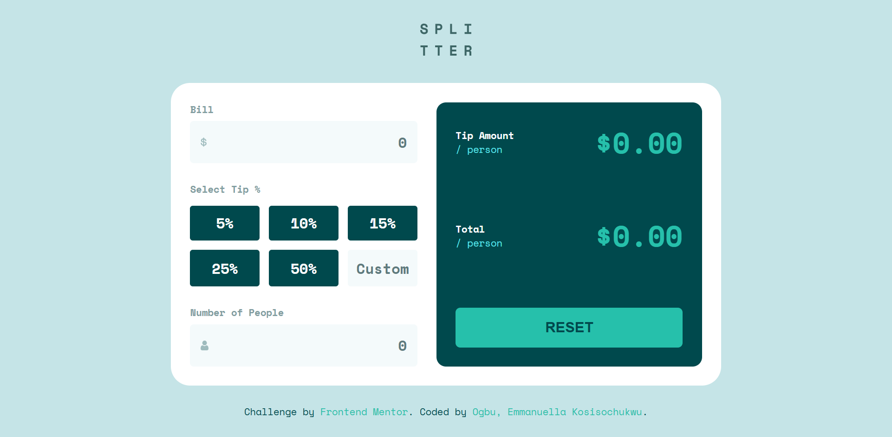

# Frontend Mentor - Tip calculator app solution

This is my solution to the Frontend Mentor Tip Calculator challenge. This project helped me strengthen my understanding of JavaScript logic, calculations, state management, validation, and DOM manipulation.

## Table of contents

- [Frontend Mentor - Tip calculator app solution](#frontend-mentor---tip-calculator-app-solution)
  - [Table of contents](#table-of-contents)
  - [Overview](#overview)
    - [The challenge](#the-challenge)
  - [Screenshot](#screenshot)
  - [Links](#links)
  - [My process](#my-process)
    - [Built with](#built-with)
  - [What I learned](#what-i-learned)
  - [Challenges I faced](#challenges-i-faced)
  - [Continued development](#continued-development)
  - [Useful resources](#useful-resources)
  - [Author](#author)
  - [Acknowledgments](#acknowledgments)
  
---

## Overview

### The challenge

Users should be able to:

- Calculate the correct tip and total cost per person
- Select predefined tip percentages
- Enter a custom tip percentage
- See live updates while typing
- Reset the calculator
- See validation errors when the number of people is zero

---

## Screenshot



---

## Links

- Live Site URL: [https://emmanuella-ogbu.github.io/Frontend-Mentor-Challenges/tip-calaculator-main/]
- Frontend Mentor Solution URL: [https://www.frontendmentor.io/solutions/tip-calculator-app-using-html-css-and-javascript-HtfmVENKkj]

---

## My process

### Built with

- Semantic HTML5
- CSS custom properties
- Flexbox
- CSS Grid
- Mobile-first workflow
- JavaScript
- DOM manipulation
- Event handling

---

## What I learned

This project helped me better understand how multiple JavaScript concepts work together in a real application.

Concepts I practiced include:

- DOM selection
- Event listeners
- State management
- Reusable functions
- Form validation
- Live UI updates
- Accessibility using `aria-pressed`
- Dynamic class manipulation

One major concept I learned was using state variables:

```css
.tip-buttons {
    display: grid;
    grid-template-columns: repeat(2, 1fr);
    gap: 1rem;
}

.inputs, .results {
    flex: 1; /* For equal width btw inputs and result class */
   }

   .tip-buttons {
      grid-template-columns: repeat(3, 1fr);
   }
```

```js
let selectedTip = 0
```

This stored the currently selected tip percentage and allowed the calculator function to update dynamically.

I also learned how to use `.closest()` to target wrapper containers for validation styling:

```js
const peopleWrapper =
    peopleInput.closest('.input-image')
```

---

## Challenges I faced

I initially struggled with combining multiple JavaScript concepts together, especially:

- loops
- functions
- state management
- validation
- DOM updates

Understanding why wrapper elements were targeted instead of raw inputs was also challenging at first.

This project improved my ability to debug problems and understand how JavaScript interacts with CSS classes dynamically.

---

## Continued development

I want to continue improving in:

- JavaScript problem solving
- Interactive UI behavior
- State management
- Real-time updates
- Form handling
- Accessibility

---

## Useful resources

- [JavaScript.info](https://javascript.info/)
- [MDN Web Docs](https://developer.mozilla.org/)
- [Claude](https://claude.ai/)
- ChatGPT

These resources helped me understand JavaScript concepts, DOM manipulation, validation logic, and responsive frontend development.

---

## Author

- Frontend Mentor - [@Emmanuella-Ogbu](https://www.frontendmentor.io/profile/Emmanuella-Ogbu)

---

## Acknowledgments

Thanks to JavaScript.info, MDN, Claude, and ChatGPT for helping me understand JavaScript concepts and frontend development workflows more deeply while building this project.